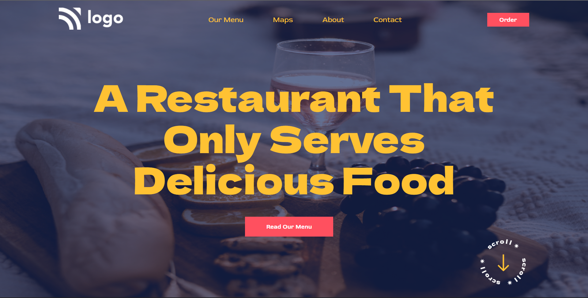

## ⭐ Project-1:Food Restaurant Landing Page⭐
This is a assignment given in **"JavaScript Full Stack Web Developer Bootcamp"** by **iNeuron**, built using **HTML5 and CSS3**.

 
## 🔗Project 2 Link
https://fsjsbootcampproject2.netlify.app/

 
## 📌 Tech Stack

&nbsp;
&nbsp;
 
 

## 📌 Overview

 

## 📌 What I Learn
    👉 Structuring **HTML** and **CSS**
    👉 Positions in CSS
    👉 CSS Selectors
    👉 Flexbox
    👉 Pseudo Selectors
    👉 CSS Transitions and hovering effect
    👉 Various properties like opacity, display, line-height, letter spacing and many more.
    👉 Applying Background image and adjusting its size and positions.

## 📬 Connect With Me

- **LinkedIn** - [K Subramanyeshwara](https://www.linkedin.com/in/ksubramanyeshwara)

## 📌 Acknowledgments

- Course Instructor - [Hitesh Choudhary](https://github.com/hiteshchoudhary)
